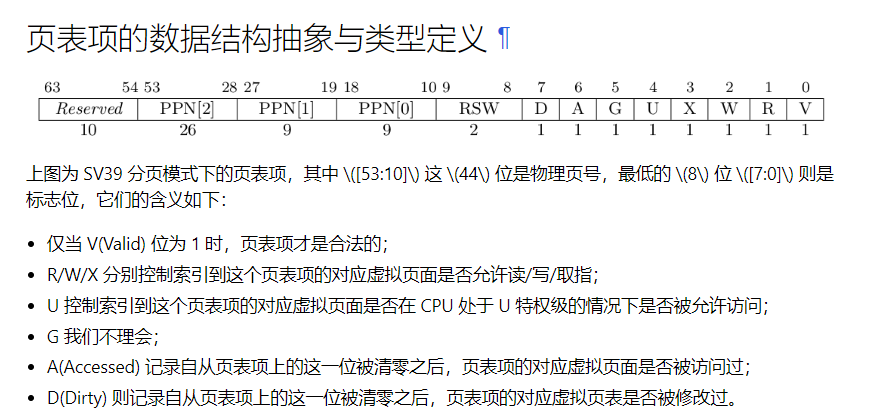

# rCore-2024S - Lab2 - report
@Author :    abcd1234  
@Time   :    2024/5/31, 12:25  
@Emaile :    abcd1234dbren@yeah.net  
## 我实现的功能
1. 将ch3内容搬迁到ch4，此过程进行了调整，以使得代码适配。
2. 继续对TaskManager增加功能。
3. 为新功能添加外界可见的接口。
4. 将接口应用于系统调用。
## 问答题
### 1. 请列举 SV39 页表页表项的组成，描述其中的标志位有何作用？

reserved为保留位，供以后拓展使用。
### 2. 缺页
缺页指的是进程访问页面时页面不在页表中或在页表中无效的现象，此时 MMU 将会返回一个中断， 告知 os 进程内存访问出了问题。os 选择填补页表并重新执行异常指令或者杀死进程。
#### 缺页可能导致的异常
PageFault：需要访问的页不在内存中，将会由os读取该缺少的页，加入内存。

IOError：需要访问的页不在内存中，os尝试读取的过程中，发现找不到该页，将会引发IOError。
#### 发生缺页时的相关寄存器
**satp 寄存器：**  
页表基址寄存器（Supervisor Address Translation and Protection Register），它用于存储页表的基址和当前的地址转换模式。当发生缺页异常时，处理器需要读取 satp 寄存器来确定当前使用的页表基址。

**sptbr 寄存器：**  
页表基址寄存器（Supervisor Page-Table Base Register），类似于 satp 寄存器，它也用于存储页表的基址。在一些 RISC-V 实现中，可能使用 sptbr 寄存器来存储页表基址。

**scause 寄存器：**  
异常原因寄存器（Supervisor Cause Register），用于存储导致异常的原因，包括是否是缺页异常。处理器在发生异常时会将异常原因存储在 scause 寄存器中。

**stval 寄存器：**  
触发异常的值寄存器（Supervisor Trap Value Register），用于存储导致异常的具体值，比如缺页异常时，会把导致缺页的虚拟地址存储在 stval 寄存器中。
#### Lazy策略的好处
延迟了页面的装入，节省了在进程启动时不必要的页表操作和内存资源。当进程真正访问某个页面时，才将其装入内存，这样可以避免不必要的磁盘 I/O 操作和内存占用。
#### 处理 10G 连续的内存页面，对应的 SV39 页表大致占用多少内存 (估算数量级即可)？
对于64位系统，页表项占8 Byte，所以10GB / 4KB（每个页面的大小） * 8B ≈ 20MB
#### Lazy策略的仿真实现
1. 当进行编译时，os记录下来可能需要的页的磁盘地址，假装其已被加载了，将此页标记为“已加载”。
2. 当进程实际访问某个页面时，os将检查该页是否已被加载，如果未加载，则触发缺页异常，访问磁盘地址，实际读页。
3. 如果页已被加载，os继续检查该页面是否存在“磁盘地址”，如果存在，则触发缺页异常，访问磁盘地址，实际读页。
4. 更新页表，将页面映射到内存中的物理地址。
5. 重新执行导致缺页异常的指令。
#### 采用Swap策略时，页面失效如何表现在页表项(PTE)上？
只需要将V位改为0即可。
### 3. 双页表与单页表
为了防范侧信道攻击，我们的 os 使用了双页表。但是传统的设计一直是单页表的，也就是说， 用户线程和对应的内核线程共用同一张页表，只不过内核对应的地址只允许在内核态访问。 (备注：这里的单/双的说法仅为自创的通俗说法，并无这个名词概念，详情见 [KPTI](https://en.wikipedia.org/wiki/Kernel_page-table_isolation) )
#### 在单页表情况下，如何更换页表？
1. 切换至内核态，准备好新的页表。
2. 将新的页表覆盖到记录页表的寄存器中。
3. 刷新缓存，例如TLB。
4. 完成，可以切换回用户态。
#### 单页表情况下，如何控制用户态无法访问内核页面？
只需要将U标志位置为0。
#### 单页表有何优势？
- 简单：单页表只需维护一张页表，简化了操作系统的设计和实现。
- 内存开销低：单页表不需要额外的内存用于存储多个页表，因此在内存消耗上相对较少。
#### 双页表实现下，何时需要更换页表？假设你写一个单页表操作系统，你会选择何时更换页表？
- 进行了上下文切换时，需要更换页表，以确保新的用户进程能够正确访问其对应的内存页面。
- 转换到内核态时，可能需要切换到内核对应的页表，以便内核能够正确访问其需要的内存页面。

我可能会选择在上下文切换或内核态切换时更换页表。（对应进程的时间片用完了需要更换进程时，和进程执行完毕，剩余时间片归还时）
## 荣誉准则
1. 在完成本次实验的过程（含此前学习的过程）中，我曾分别与 以下各位 就（与本次实验相关的）以下方面做过交流，还在代码中对应的位置以注释形式记录了具体的交流对象及内容：  
*无*

2. 此外，我也参考了以下资料，还在代码中对应的位置以注释形式记录了具体的参考来源及内容：  
*无*

3. 我独立完成了本次实验除以上方面之外的所有工作，包括代码与文档。 我清楚地知道，从以上方面获得的信息在一定程度上降低了实验难度，可能会影响起评分。

4. 我从未使用过他人的代码，不管是原封不动地复制，还是经过了某些等价转换。 我未曾也不会向他人（含此后各届同学）复制或公开我的实验代码，我有义务妥善保管好它们。 我提交至本实验的评测系统的代码，均无意于破坏或妨碍任何计算机系统的正常运转。 我清楚地知道，以上情况均为本课程纪律所禁止，若违反，对应的实验成绩将按“-100”分计。

## 看法
建议编程题目的题干处，增加一定的任务说明。

我在实现的过程中，最开始考虑到，对于mmap和munmap，应该由操作系统去实际完成，而并非由当前任务去完成。但是，这就导致task包的可见性被破坏地一干二净，同时，也无法通过测试。  
之后，我通过重新读实验指导书，发现示例代码好像都是基于“current-task”进行各种操作，于是，我直接把之前写的但无法通过测试的代码复制到task包，并且提供接口，就能通过了！在这个过程中，我并没有修改我的核心功能代码，只是做了接口适配！

所以，我建议在这里说明，要在task包中实现，要不然太折磨了，你不得不去思考到底应该为os增加新的数据结构...，还是破坏掉单一职责原则，为task实现需要涉及内存的mmap和munmp，之后通过current-task调用就可以。从极端的面向对象思想来考虑，应该为os实现，但难度极高，且对于测试就是不通过。我被这个东西卡了3天！